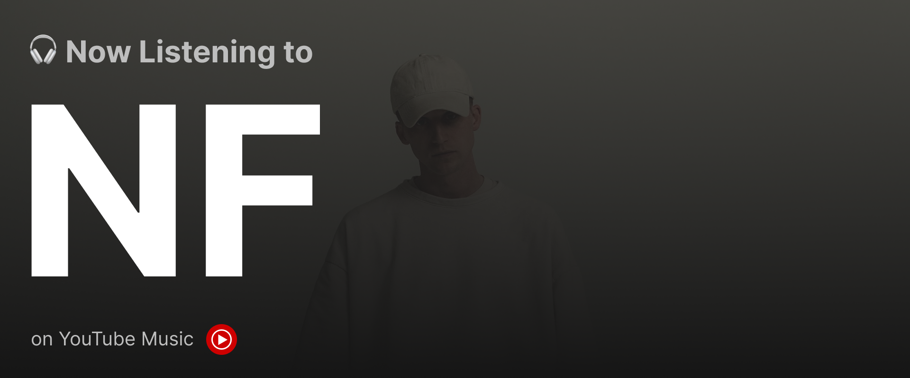

<!-- Banner -->

  

# Hi, I'm Abhijeet 👋  

I build **developer-first tools** that make documenting, coding, and scaling products easier. Currently hacking on 🚀 **Docable** & 🛠 **Overide**.  

## 🌟 Featured Projects  

### 📖 Docable – One-stop documentation for dev teams  

  

  
Making documentation effortless by bringing together Notion, Draw.io, Google Docs, Slides, Jira, and Confluence — all in one place.  

### ⚡ Overide – AI autocomplete for any IDE  

  

  
Open-source CLI that drops AI autocomplete right into your coding workflow.  

## 🔥 About Me
💻 Software developer working on **SaaS + open-source** projects  
🧠 Loves working with **Flutter, Electron & JS**  
🌏 Based in India, building products for the world
 

  

---

### GitHub Stats

  
  

---

### 📬 Let’s Connect

  
  
  

